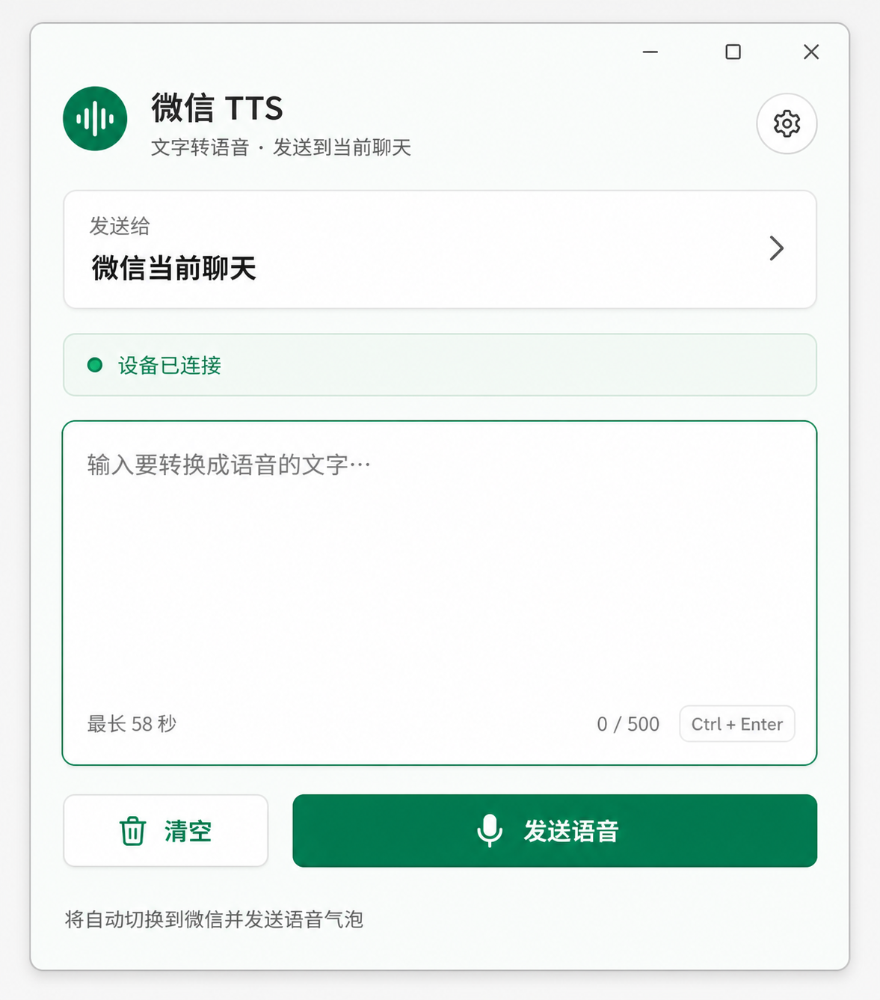

# wechat-tts-voice-bubble

一个用于 Windows 微信桌面客户端的 TTS 语音挂件。输入文字后，程序调用 TTS
接口生成音频，通过 VB-CABLE 将音频送入微信麦克风，并发送为原生语音气泡，而不是
音频文件附件。

> 本项目使用桌面 UI 自动化操作当前打开的微信聊天，不修改微信进程，也不使用私有协议。

## 软件截图



## 功能

- Material 风格的图形界面，无需在命令行中发送消息；
- 输入文字后，一键发送到微信当前打开的聊天；
- 支持 `Ctrl+Enter` 快捷发送；
- 自动检查微信窗口、RDP 会话、默认麦克风和 VB-CABLE 播放设备；
- 自动调用 TTS、进入微信录音模式、播放音频并点击发送；
- WASAPI 不可用时自动尝试 DirectSound 和 MME；
- Bearer Token 使用 Windows DPAPI 加密后保存在当前用户目录；
- 单条语音最长 58 秒。

## 环境要求

- Windows 10/11；
- 已登录的微信桌面客户端；
- 标准版 VB-CABLE Virtual Audio Device；
- 一个能够返回音频的 HTTP TTS 接口。

## 安装 VB-CABLE

本项目需要的是 VB-Audio 提供的**标准版单根 VB-CABLE**：

- 产品名称：`VB-CABLE Virtual Audio Device`；
- Windows 安装包：`VBCABLE_Driver_Pack45.zip`；
- [VB-Audio 官方产品页面](https://vb-audio.com/Cable/)；
- [直接下载 Windows 驱动包](https://download.vb-audio.com/Download_CABLE/VBCABLE_Driver_Pack45.zip)。

不需要购买或安装 `VB-CABLE A+B`、`VB-CABLE C+D`、`Hi-Fi Cable` 或
`VoiceMeeter`。标准版 VB-CABLE 已经能够完成本项目需要的单路音频转发。

安装步骤：

1. 下载并完整解压 `VBCABLE_Driver_Pack45.zip`，不要直接在 ZIP 中运行安装程序；
2. 64 位 Windows 右键点击 `VBCABLE_Setup_x64.exe`，选择“以管理员身份运行”；
3. 点击安装驱动，完成后**必须重启 Windows**；
4. 重启后，声音设备列表中应出现播放端 `CABLE Input` 和录音端
   `CABLE Output`；
5. 将 Windows 默认输入/麦克风设为 `CABLE Output`。

音频会从程序使用的 `CABLE Input` 播放端进入，再从微信使用的
`CABLE Output` 麦克风端输出。

## 快速开始

### 使用发行版

1. 从 [Releases](https://github.com/AEVEC/wechat-tts-voice-bubble/releases)
   下载 `WeChatTTS-win-x64.zip`。
2. 解压整个 `WeChatTTS` 文件夹，不要只复制其中的 EXE。
3. 按照上面的说明安装标准版
   [`VBCABLE_Driver_Pack45.zip`](https://download.vb-audio.com/Download_CABLE/VBCABLE_Driver_Pack45.zip)，
   然后重启 Windows。
4. 在 Windows 声音设置中，将默认输入设备设为
   `CABLE Output (VB-Audio Virtual Cable)`。
5. 打开微信，并进入准备接收语音的聊天。
6. 运行 `WeChatTTS.exe`。
7. 点击右上角设置按钮，填写 TTS 接口地址和 Bearer Token。
8. 输入文字，等待状态显示设备已连接，然后点击“发送语音”。

程序会自动切换到微信当前聊天。发送前请自行确认当前联系人或群聊是否正确。

### 从源码运行

```powershell
conda create -n wechat-tts-voice python=3.11 -y
conda activate wechat-tts-voice
pip install -r requirements.txt
pythonw wechat_tts_widget.pyw
```

也可以双击项目中的 `启动微信TTS挂件.vbs`。

## TTS 接口格式

挂件会向设置中的接口发送以下请求：

```http
POST /v1/tts
Authorization: Bearer <token>
Content-Type: application/json
```

```json
{
  "text": "要转换成语音的文字",
  "text_lang": "zh"
}
```

接口应直接返回可由 libsndfile 读取的音频内容，例如 WAV；不要返回 JSON 包装或下载
地址。默认接口地址为 `http://ws:8000/v1/tts`，可在设置窗口中修改。

## 工作原理

```text
文字 → TTS 接口 → WAV → CABLE Input（播放端）
                              ↓
                    CABLE Output（麦克风端）
                              ↓
                    微信录音 → 原生语音气泡
```

挂件在发送前检查当前会话和设备状态，然后激活唯一的微信主窗口，通过界面坐标进入
语音录制模式。音频播放完成后，它会点击微信发送控件并验证录音模式已经退出。

## 配置与日志

配置文件和日志位于：

```text
%APPDATA%\WeChatTTSWidget\
```

- `config.json`：TTS 地址、DPAPI 加密后的 Token 和窗口位置；
- `widget.log`：运行及发送日志。

发行包不会包含本机配置、Token 或日志。换到另一台电脑后需要重新配置。

## 常见问题

### 提示默认麦克风不是 CABLE Output

在 Windows 声音设置中把 `CABLE Output` 设为默认输入设备，然后重新打开微信和挂件。
`CABLE Input` 是程序播放音频的一端，`CABLE Output` 才是微信使用的麦克风端。

### 提示未找到微信主窗口

确认微信已经登录并显示主窗口，而不是只在系统托盘中运行。当前版本要求恰好存在一个
可用的微信主窗口。

### RDP 或锁屏环境无法发送

Windows 远程桌面和锁屏可能隔离录音设备或使 UI 自动化失效。请在本地控制台会话中
运行，或者使用不会切换 Windows 会话的远控方式。

### 点击后没有进入录音模式

保持微信窗口尺寸不小于 `650×500`，确认当前聊天支持发送语音。微信界面更新后，录音
按钮位置可能变化，需要重新适配 UI 坐标。

## 构建 Windows 发行包

先安装构建依赖：

```powershell
pip install -r requirements-build.txt
```

然后运行：

```powershell
powershell -ExecutionPolicy Bypass -File .\build-release.ps1
```

构建结果位于：

```text
release\WeChatTTS-win-x64.zip
```

## 注意事项

- 程序发送给微信当前打开的聊天，无法可靠读取微信自绘界面中的联系人名称；
- 微信客户端更新可能导致 UI 自动化坐标失效；
- 请勿将 TTS Token、`config.json` 或日志提交到公开仓库；
- 请合理使用自动化功能，避免批量发送、骚扰或违反平台规则的行为。
